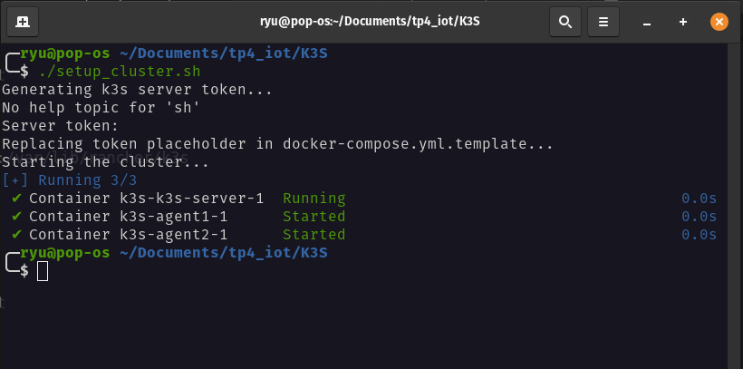
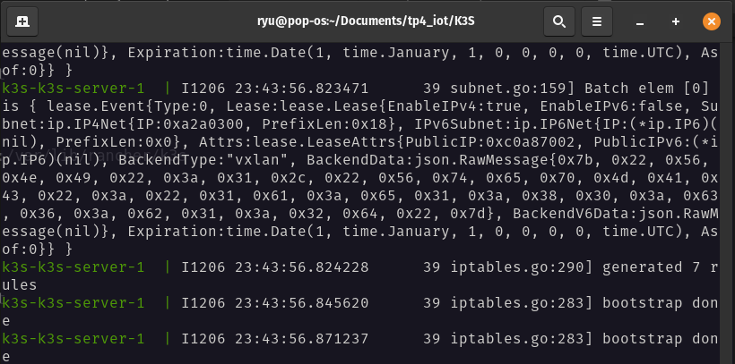

# TP4 IOT: k3s,k3d and helm

> Made By 
> * **Oussema Jaouadi** group 2.2
> * **Taha Mediouni** group 2.2

> Note : This readme.md is explaining the process of the tp in details but the answers :
> - [Markdown format](reponse%20aux%20question.md)
> - [PDF format]() 

## Create Our own architecture 

In the first part of the tp we will create our server node architecture .

For this there are 2 main approaches :
    - Using docker compose to create different services using `rancher/k3s` containers and managing the network and the volume to share token
    - Using terraform and ansible to create 3 different Virtual Machines and run a playbook to configure ssh for configuration

We choosed to use docker compose apporach 

In our docker compose 

* We defined our services  ( `server`,`agent1` and `agent-2` )
* We defined the network so our services runs on the same network
* We defined a volume as a secure way to exchange the token ( even us we don't know the exchanged token )




> It was a failed attemp we need to debug the image source it self 

## Using k3d and continuating the TP 

`k3d` or `k3s in docker` is a powerful tool , it creates our k3s architecture in docker images (like we did ourselves,it is good to do things manually before learning tools)

### 1. Installation

```bash
wget -q -O - https://raw.githubusercontent.com/k3d-io/k3d/main/install.sh | bash
```

### 2. Creating our architecture in yaml

The template for defining the architecture goes like this 

```yaml
apiVersion: k3d.io/v1alpha5
kind: Simple
metadata:
  name: tp-k3s # The name of cluster
servers: 1 # Number of servers
agents: 2 # Number of agents
ports:
  - port: 5000:5000 # Exposing a port for our application
    nodeFilters:
      - loadbalancer
```

Then we execute 

```bash
k3d cluster create -c make_cluster.yaml
```

### 3. Creating application + Dockerfile


We created a simple flask application, this application is just an endpoint .
We created Dockerfile so we can build our containarizated application and we can push it into docker repositories ( we pushed it in [dockerhub](https://hub.docker.com/r/oussemajaouadi/tp4_iot) )

### 4. Creating a manifest for our application

We created a yaml manifest for our application so we use in deployment , the yaml contains both Deployment and Service

```yaml
---
apiVersion: apps/v1
kind: Deployment
metadata:
  name: flask-app
  labels:
    app: flask-app-deployment
spec:
  replicas: 3
  selector:
    matchLabels:
      app: flask-app
  template:
    metadata:
      labels:
        app: flask-app
    spec:
      containers:
      - name: flask-app
        image: flask-app
        ports:
        - containerPort: 5000
        imagePullPolicy: Always
---
apiVersion: v1
kind: Service
metadata:
  name: flask-app-service
spec:
  selector:
    app: flask-app-deployment
  ports:
  - protocol: TCP
    port: 5000
    targetPort: 5000
    nodePort: 30080
  type: NodePort
```

Then we apply the modification with 
```bash
kubectl apply -f K3D_HELM/app.yaml
```