# Reponse aux question du TP

> Ce fichier et dédier pour répondre au questions du tp, le process de déroulement se trouve [ici](Readme.md) 

| Nom      | Prénom   | Groupe |
|----------|----------|--------|
| Jaouadi  | Oussema  | G 2.2  |
| Mediouni | Taha     | G 2.2  |

## 1. Installation des deux machines virtuelles Raspberry 64bits :

Le role de `getconf LON_BIT` :
* Elle retourne l'architecture de notre os 
* C'est `32` pour l `raspberry`

## 2. Installation k3s avec un seul serveur

### a. Donner en résumé avec explication des lignes de configurations de serveur K3s ?

```bash
# Pour installation
curl -sfL https://get.k3s.io | sh -
```

### b. Vérification de l’installation : écrire les commandes de vérification de l’installation correcte du serveur K3s

```bash
# Pour verification d'installation
sudo kubectl get node
```

### c. sudo kubectl get node ? sudo kubectl get nodes -o wide ? kubectl get pods -A ?

* `kubectl get nodes`: Cette commande affiche une liste des nœuds dans le cluster Kubernetes.
    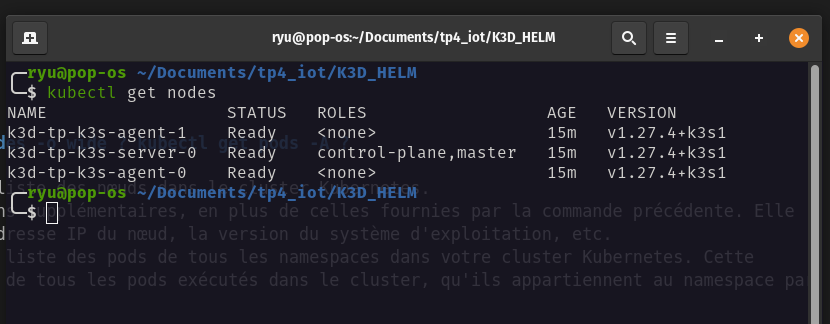
* `-o wide`: Cette commande affiche des informations supplémentaires, en plus de celles fournies par la commande précédente. Elle inclut des colonnes supplémentaires telles que l'adresse IP du nœud, la version du système d'exploitation, etc.
* `kubectl get pods -A`: utilisée pour afficher la liste des pods de tous les namespaces dans votre cluster Kubernetes. Cette commande est utile pour obtenir une vue d'ensemble de tous les pods exécutés dans le cluster, qu'ils appartiennent au namespace par défaut ou à d'autres namespaces.

### d. d. Donner la commande ou les commandes qui permettent de redémerrer le serveur K3s :

```bash
# Pour redemarrage
sudo systemctl restart k3s
```

## 3. Installation k3s avec plusieurs nœuds agents

### a. Comment récupérer le token (K3S_TOKEN : variable d’environnement sur le Token) du serveur

```bash
# Sur le serveur 
k3s token generate
```

### b. Quelles sont les commandes de configuration d’un nœud agent K3s

```bash
# sur le serveur
k3s token generate

# sur les agents
curl -sfL https://get.k3s.io | K3S_URL=https://server:6443 K3S_TOKEN=<le token generée> sh -

# on the server node
sudo kubectl get node
```

## 4. Installation de helm

### Role de helm :

Helm est le package manager de kubernetes ( comme `npm` pour `node` ou bien `pip` pour `python` ..)

Helm est un outil qui facilite l'installation et la gestion d'applications sur Kubernetes en utilisant des paquets préconfigurés appelés "charts". Cela simplifie le déploiement d'applications dans des environnements Kubernetes.

### Installation 

Helm est pré-installer si on utilise `k3s` et `k3s` mais on l'installe comme ça d'aprés la documentation

```bash
curl -fsSL -o get_helm.sh https://raw.githubusercontent.com/helm/helm/main/scripts/get-helm-3
chmod 700 get_helm.sh
./get_helm.sh
```

### helm list -n kube-system

La commande "helm list -n kube-system" permet de lister les déploiements Helm dans l'espace de noms "kube-system" de Kubernetes. Elle affiche les informations sur les applications déployées, telles que les versions et les statuts.
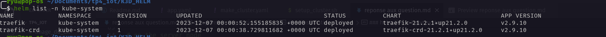

### signification du déploiement de Traefik sur le namespace kube-system

Le fait de déployer Traefik dans "kube-system" signifie qu'on utilise Traefik pour gérer comment les gens accèdent aux applications sur notre cluster Kubernetes. C'est comme un gardien qui s'assure que tout le trafic va là où il doit aller, en simplifiant la gestion des connexions externes aux services du cluster.

## 5. Docker

### role du run hello world

Aprés l'installation du docker on doit verifie si docker et installer comme il faut et peut importer (pull) des images ou non pour cela on essay d'importer une image minimal qui s'applle hello_world et verifie que notre installation se fait avec success

### dockerizer et deployer une application

On a crée un endpoint qui retourne un json indiquant qu'on a access à notre application .
Pour la contenarizer on a crée un Dockerfile

```Dockerfile
FROM python:3.11-alpine # je choisis generalement alpine car elle est minimal

WORKDIR /project

COPY requirements.txt .

RUN pip install --no-cache-dir -r requirements.txt

COPY . .

EXPOSE 5000

CMD ["python", "app.py"]
```

Aprés on procede a builder et tager cette image 

```bash
docker build -t test:1 .
docker login # login into our dockerhub account
docker tag test:1 oussemajaouadi/tp4_iot
docker push oussemajaouadi/tp4_iot
```
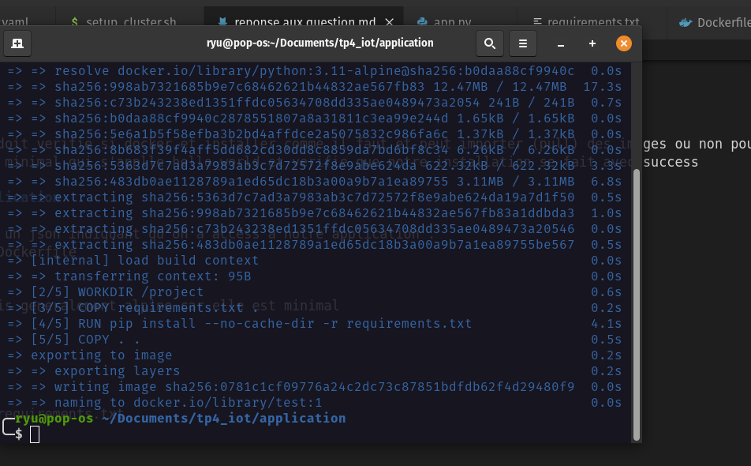
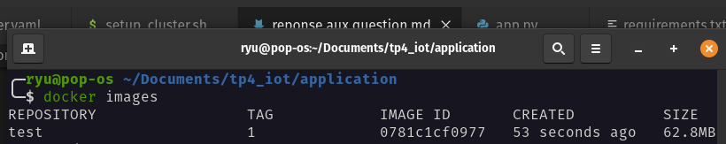

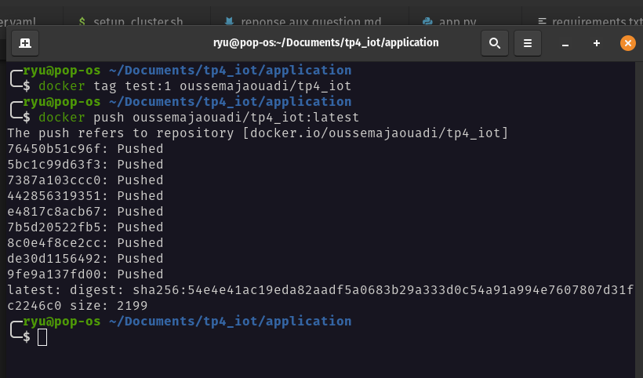

### Deployment de l'application sur le cluster

Pour deployer l'application dans le cluster on a crée un [app.yaml](./K3D_HELM/app.yaml) 
Puis on execute 
```bash
kubectl apply -f K3D_HELM/app.yaml
```
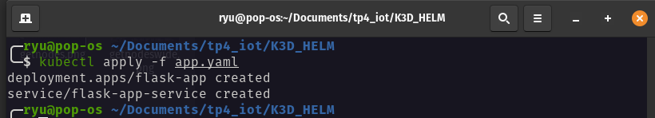

### Get deployment

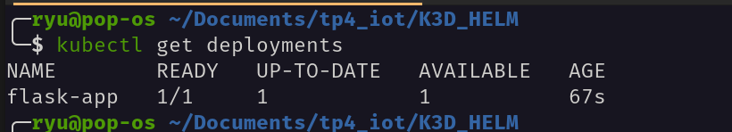

### Get services

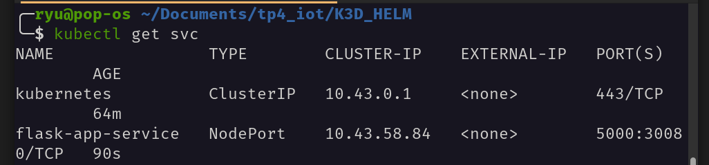

### Get pods

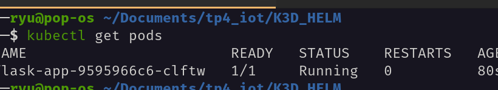

### Exposer le deploiment

```bash
kubectl expose deployment flask-app-deployment --type=NodePort --name=flask-app-service --port=5000 --target-port=5000
```

Mais on ne vas pas executer cette commande car notre port est déjà expose dans le yaml 

### describe service

Cette commande `kubectl describe service <service_name>` nous donne des informations sur la service (les replicas , le type , les ports exposes ) comme suit :

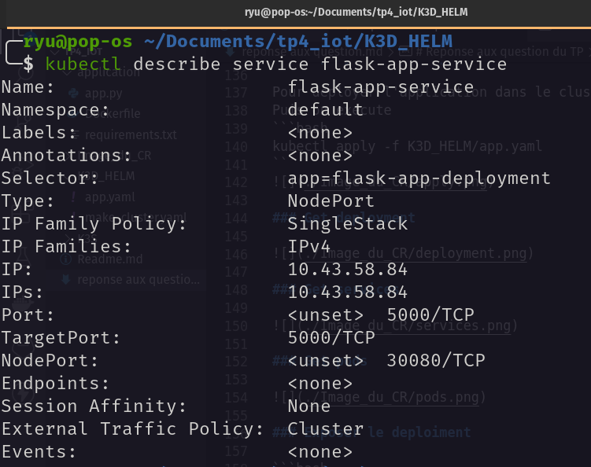


### Application fonctionne bien 

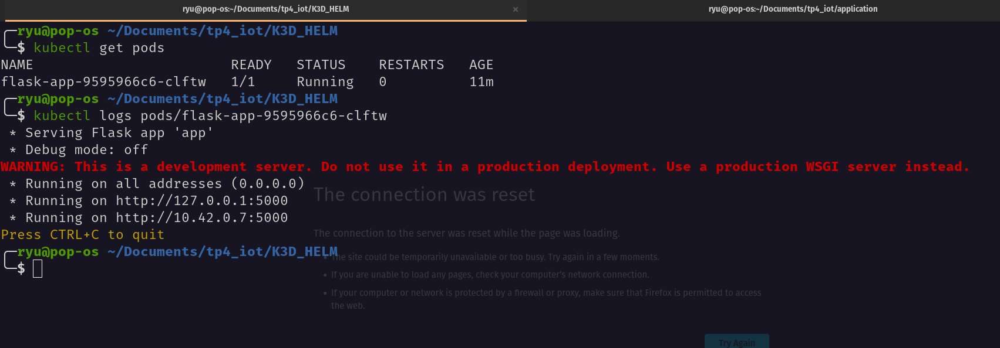